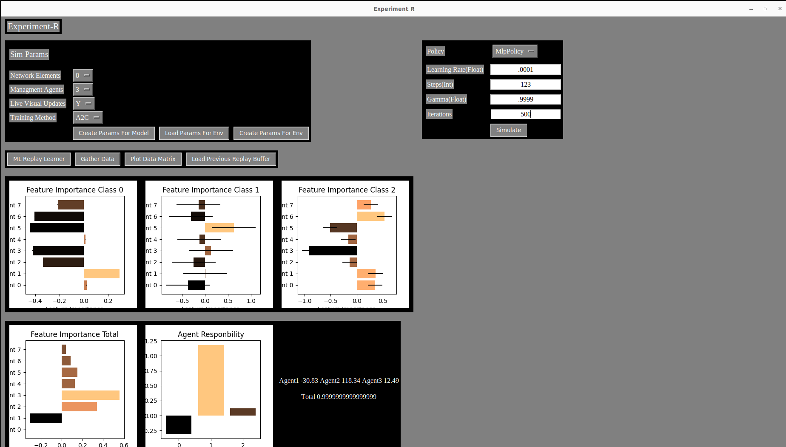

# xAI-RL
Associated Figures and code snippets from Closing the Responsibility Gap in AI-based Network Management: An Intelligent Audit System Approach
https://arxiv.org/abs/2502.05608

This paper is published in Globecom 2024, however an advanced copy is available at Arxiv. 

This repo will show the game environments introduced in the paper along with the test bed used to train the multiple different algorithms, along with the custom DQN algorithm. 

The contributions of the paper are as follows:
> A framework to identify and find AI management agents modifying a core network using network status logs.
>
> The framework can measure the impact the AI management tool has on network changes
>
> Explanation of a RL and ML model decision making. 

This repo includes the enviornments in which a DRL agent was trained on to make changes to a network.

It then features a framework utilizing local machine learning explanbility to understand why the decision are being made.

This reverse engineers the environment that it was trained on without ever seeing the environment. 

Current work on this repo will introduce a tool where the simulation parameters can be changed and different algorithms can be used.

Also a configurable Deep Learner will be Introduced. 

A optional render to see the DRL agent being trained will also be included. 

As of right now a ``GYM_Env.ipynb`` can be ran to on the standard environment with 3 management agents and 8 network elements. 

It also includes an entire testbed for the different applicable RL algorithms provided by Stable Baselines 3.

## Installation

Tested and working on `Ubuntu-22.04` with `Python 3.9.12` . 

To install requirements :
    `pip install -r requirements.txt` 

## Future Features:

  

